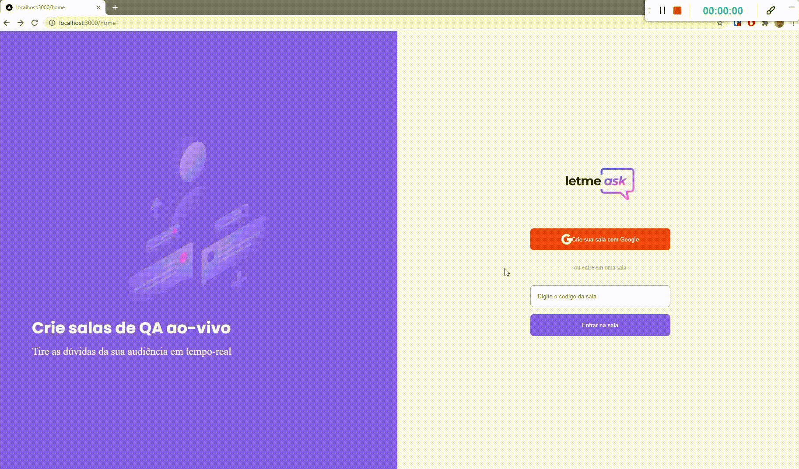

## 👁️‍🗨️ **Preview**

---



---

## 🍄 Sobre

Letmeask é perfeito para criadores de conteúdos poderem criar salas de Q&A com o seu público, de uma forma muito organizada e democrática.

Este é um projeto desenvolvido durante a Next Level Week Together da Rocketseat, apresentada dos dias 20 a 27 de Junho de 2021.

---

## 📝 **Tarefas**

<div align="center">
<details>
<summary>Clique para visualizar</summary>

| Estado | Tarefa                             |
| :----: | :--------------------------------- |
|   ✔️   | Autenticação social com Firebase   |
|   ✔️   | Criar uma sala                     |
|   ✔️   | Entrar em uma sala                 |
|   ✔️   | Criar perguntas de uma sala        |
|   ✔️   | Dar like em perguntas              |
|   ✔️   | Marcar pergunta como destaque      |
|   ✔️   | Marcar pergunta como respondida    |
|   ✔️   | Remover uma pergunta               |
|   ✔️   | Encerar uma sala                   |
|   ✔️   | Permissão de perfil                |
|   ✔️   | Contexto de autenticação           |
|   ✔️   | Recuperar o estado de autenticação |
|   ✔️   | Realtime dos dados                 |

</details>
</div>

---

## 🧪 **Tecnologias**

Esse projeto foi desenvolvido com as seguintes tecnologias:

<div align="center">

|                    🧪 Web                     |
| :-------------------------------------------: |
|         [Nextjs](https://nextjs.org/)         |
| [TypeScript](https://www.typescriptlang.org/) |
|        [Sass](https://sass-lang.com/)         |
|   [Firebase](https://firebase.google.com/)    |

</div>

---

## 🎮 **Ambiente de desenvolvimento**

-   Será necessário criar uma conta no [Firebase](https://firebase.google.com/) e um projeto para disponibilizar os serviços de Authentication e Realtime Database.
-   Configure as variaveis de ambiente. Para isso crie o arquivo .env.local com base no arquivo .env.example

```bash
node --version
v16.0.0

yarn --version
1.22.4
```

---

## 🚀 Como executar

-   Clone o repositório
-   Instale as dependências com `yarn`
-   Inicie o servidor com `yarn dev`
-   O app estará disponível no seu browser pelo endereço [`localhost:3000`](http://localhost:3000).

---

## ⚖️ **Licença**

Esse projeto está sob a licença MIT. Veja o arquivo [LICENSE](LICENSE.md) para mais detalhes.

---

Feito com ♥ by Rafael Angonese
